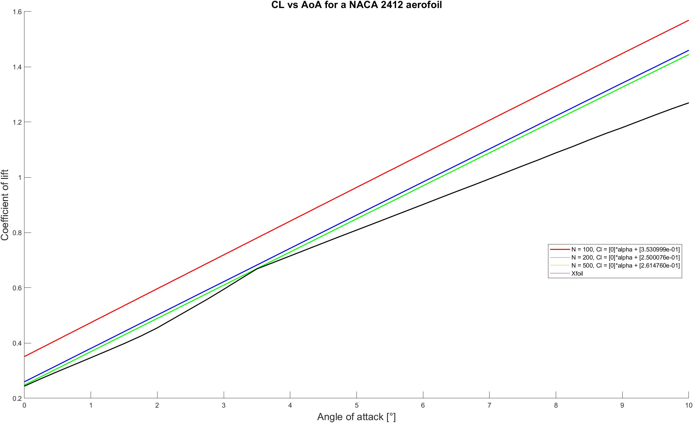
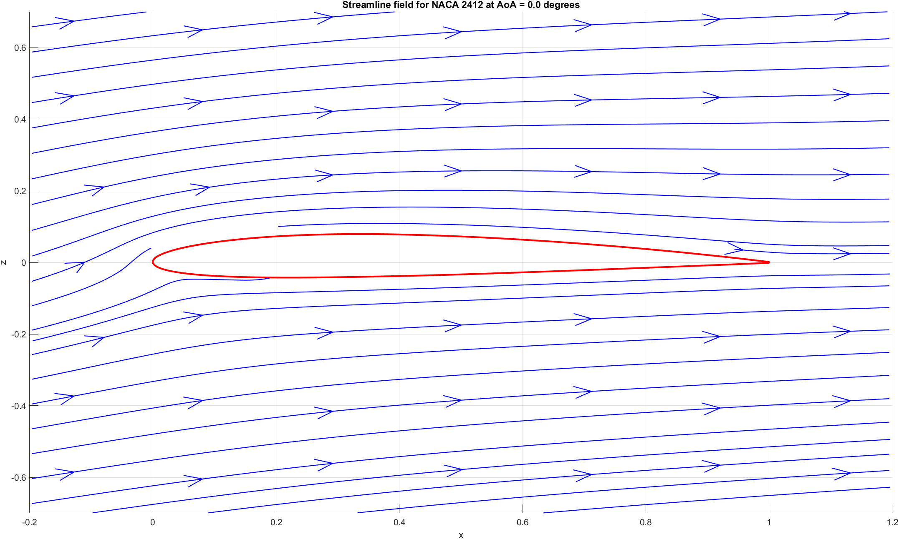

This is my MATLAB coursework from my first year of my degree. The aim of this coursework was to create a program that can analyse an aerofoil using the panel solving method to make predictions on its characteristics (CL, Cd, ect...) and then compare them to data obtained from Xfoil. 

The solver achieved good performace when compared to Xfoil. It had an average error of 8.52% when compared to Xfoil whilst using a sufficiently large number of panels and analysing an aerofoil  within a laminar flow regime. 

Program allows for the angloe of attack and the NACA code of the aerofoil to be adjusted as well as the number of panels used and the flow properties.
