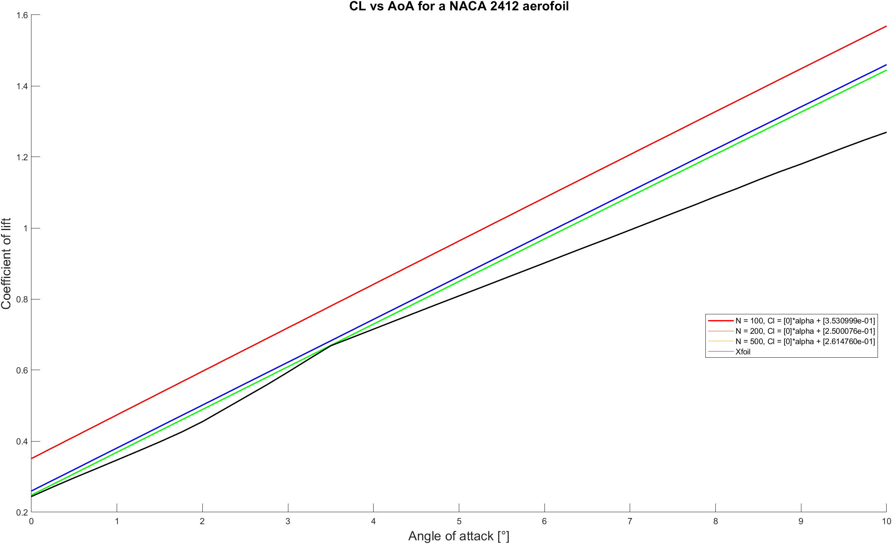

This is my MATLAB coursework from my first year of my degree. The aim of this coursework was to create a program that can analyse an aerofoil using the panel solving method to make predictions on its characteristics (CL, Cd, ect...) and then compare them to data obtained from Xfoil. 

The solver achieved good performace when compared to Xfoil.
